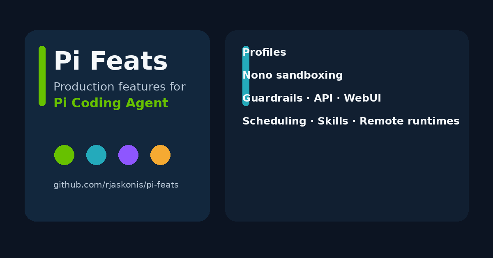

# Pi Feats

> Production-oriented extensions for [Mario Zechner's Pi Coding Agent](https://github.com/badlogic/pi-mono): profiles, Nono sandboxing, guardrails, HTTP/API access, scheduling, Skills, remote runtimes, and a WebUI.

`pi-feats` turns the lightweight, extensible Pi Coding Agent into an operational workspace without replacing Pi's native configuration model. It adds persistent profiles, a policy-controlled sandbox, HTTP and browser interfaces, application runtimes, scheduled work, Git-backed Skill discovery, and command-line administration.



## Contents

- [Glossary](#glossary)
- [Features](#features)
- [Command cookbook](#command-cookbook)
- [Included extensions](#included-extensions)
- [Installation](#installation)
- [Development](#development)
- [Security](#security)
- [Package layout](#package-layout)

## Glossary

| Term | Meaning |
| --- | --- |
| **Profile** | An isolated Pi workspace with its own settings, credentials, model state, sessions, `SOUL.md`, and optional local Skills. Extensions and packages remain in the shared default runtime. |
| **Sandbox** | A Nono policy that constrains a named profile's process, filesystem, network, and credentials. |
| **Application** | An integration runtime that accepts external payloads, routes them into Pi sessions, and can return an integration-specific response. |
| **Handler** | TypeScript code owned by one Application. Inbound handlers normalize payloads; outbound handlers shape responses; transforms enrich or modify data. |
| **Identity Key mapping** | A rule that maps an external identity to an Application profile and session strategy. A single `*` mapping can be an explicit fallback. |
| **Handoff** | Private context retained when an Application rolls a conversation into a replacement session. |
| **Guardrail** | An ordered policy instruction executed at an input, tool, or output lifecycle stage. |
| **Shared Skill** | A Skill stored in the main Pi agent directory and selectively exposed to profiles. |
| **Profile Skill** | A Skill stored in one profile directory and unavailable to other profiles unless explicitly copied or imported. |
| **Skill Source** | A Git-backed staging catalog. Synchronizing it discovers Skills but does not activate them. |
| **Pulse** | A persistent scheduled prompt, reminder, cron job, one-time job, or heartbeat bound to a profile and session. |
| **Remote Host** | A registered SSH target that runs its own Pi command, profiles, packages, and resources. |
| **Pi Console WebUI** | The authenticated browser operations cockpit for the API Server, profiles, Applications, Skills, Pulses, logs, and terminal. |

## Why Pi Feats?

Pi Coding Agent intentionally keeps its core lightweight and extensible. Pi Feats is a distributable extension package for operational and server-side deployments that need capabilities such as:

- isolated Pi Agent profiles and policy-controlled Nono sandboxing;
- guardrails across input, tool, and output stages;
- an HTTP API and authenticated operations WebUI;
- scheduled agents, Git-backed Skill distribution, and remote Pi runtimes;
- application routing for multi-user and integration workloads.

## Features

### Profiles and sandboxing

- Create, delete, list, open, and resume named Pi profiles.
- Keep profile-scoped settings, credentials, model catalogs, sessions, `SOUL.md`, Skills, and environment variables under `~/.pi/agent/profiles/<profile>/`.
- Run named profiles through a [Nono](https://github.com/Anthropic/nono) policy while the default profile remains unsandboxed.
- Preserve native Pi state directly in the profile directory; profiles do not use a disposable credential runtime.
- Limit profile tools, shared Skills, and profile Skills through profile policy.
- Keep extensions and packages in the default runtime; named profiles load those shared resources read-only and never clone or install them.
- Load a profile-specific `SOUL.md` into every agent turn.

### Remote Hosts

Operate another Pi installation as if its CLI were local. `pi-feats` opens an SSH connection with a remote PTY, then forwards the requested arguments without attempting to resolve remote profiles, packages, models, Skills, or sessions locally. The remote Pi remains authoritative for its own state.

- Register host or Docker-container runtimes interactively, including the remote user, SSH authentication, runtime, container, and Pi agent directory.
- Store the remote agent directory explicitly, avoiding ambiguity between Pi's parent data directory and native `~/.pi/agent` directory.
- Validate SSH access and the remote Pi command during registration.
- Use every normal Pi command remotely, including profiles, Skills, resource management, sessions, packages, and an interactive shell.

```bash
# Register, inspect, and remove a remote host
pi remote add production
pi remote list
pi remote delete production --force

# Start the remote default profile or a named profile
pi remote:production
pi remote:production profile support

# Forward ordinary Pi commands to the remote runtime
pi remote:production profile support skills list
pi remote:production profile support skills enable incident-response
pi remote:production profile support sessions list
pi remote:production packages list

# Open a shell in the selected remote host or container runtime
pi remote:production bash
```

This makes a central workstation useful for operating multiple Pi environments without copying their credentials or resource catalogs to the local machine.

### Applications and handlers

Applications are the integration boundary between Pi and external systems. Use one when a webhook, chat platform, business system, queue consumer, or custom service needs to turn inbound data into a durable Pi conversation and optionally return a response. An Application owns its routing and code; it does not depend structurally on an adapter.

- Create independent Applications with their own settings, identity-key mappings, active sessions, logs, rollover, and handoff state.
- Store each Application separately at:

  ```text
  ~/.pi/agent/applications/<application-slug>/
  ```

- Create an `inbound.ts` handler automatically with every new Application.
- Keep application handlers isolated per Application:

  ```text
  handlers/inbound.ts
  handlers/outbound.ts
  handlers/transforms/<name>.ts
  ```

- Normalize provider-specific payloads in an inbound handler, enrich or redact data through transforms, and shape integration responses in an outbound handler.
- Route each external identity to a profile and session strategy through explicit Identity Key mappings. Mappings may use automatic sessions or fixed prefixes; one `*` wildcard can serve as a deliberate fallback.
- Choose acknowledgement mode for asynchronous webhook-style work or result mode when an integration needs the completed response.
- Inspect active sessions, roll over a conversation, preserve private handoff context, test handlers with a JSON payload, and stream or clear application logs from the Console or API.
- Include an Evolution API adapter implementation while keeping Applications structurally independent from adapters.

Create and operate Applications from the **Applications** workspace in the Console, or automate them through the API:

```bash
# Create an integration boundary
curl -X POST \
  -H "Authorization: Bearer $PI_API_TOKEN" \
  -H "Content-Type: application/json" \
  -d '{"name":"Support Inbox","slug":"support-inbox","defaultProfile":"support","responseMode":"ack"}' \
  http://127.0.0.1:8767/api/applications

# Inspect its generated handlers
curl -H "Authorization: Bearer $PI_API_TOKEN" \
  http://127.0.0.1:8767/api/applications/support-inbox/handlers

# Deliver an integration payload to an enabled Application
curl -X POST \
  -H "Content-Type: application/json" \
  -d '{"message":"A customer needs help with an order."}' \
  http://127.0.0.1:8767/api/message/app/support-inbox
```

### API Server

The API Server is the automation and integration surface for Pi. It turns the same persistent profiles and sessions used in the terminal into an authenticated HTTP service, enabling WebUI administration, external applications, webhooks, and programmatic chat without inventing a second state model.

```bash
# Start, inspect, restart, and stop the service
pi api start
pi api status
pi api restart
pi api stop

# Read the generated bearer token
export PI_API_TOKEN="$(jq -r '.apiToken' ~/.pi/agent/api-server.json)"

# Check service health
curl http://127.0.0.1:8767/api/health

# Send an authenticated message to a persistent session
curl \
  -H "Authorization: Bearer $PI_API_TOKEN" \
  -H "Content-Type: application/json" \
  -d '{"message":"Summarize the current incident."}' \
  http://127.0.0.1:8767/api/sessions/incident/chat
```

What the API exposes:

- Persistent chat and streaming chat sessions, including profile-specific sessions.
- Profile lifecycle, settings, `SOUL.md`, environment variables, Guardrails, tools, Skills, and sessions.
- Runtime-wide extension and package inventory and configuration.
- Pulse schedules and execution history.
- Git-backed Skill Sources, document preview, synchronization, and explicit profile imports.
- Applications, handler source files, transform tests, identity-key mappings, active sessions, rollover, handoff, and live logs.
- Secure terminal and application-log WebSocket tickets that expire quickly and are consumed once.

The service generates and stores its bearer token in `api-server.json`, supports host, port, CORS, and public-base-URL configuration, rejects concurrent work on the same session, and keeps process state and logs in the Pi agent directory.

### Pi Console WebUI and terminal

The Pi Console WebUI is an operations cockpit, not merely a settings page. It gives administrators a visual way to operate the same runtime exposed by the CLI and API: inspect activity, configure profiles, edit application handlers, manage schedules, examine logs, and open a real terminal when direct command-line access is needed.

```bash
# Start, inspect, restart, and stop the WebUI
pi console start
pi console status
pi console restart
pi console stop

# Default local address
# http://127.0.0.1:3030
```

The console provides dedicated workspaces for:

- **Profiles:** settings, environment, `SOUL.md`, Guardrails, tools, Skills, and sessions. Extensions and packages are shown and managed as shared runtime resources.
- **Applications:** configuration, identity mappings, active sessions, handler editor, transform testing, rollover, handoff, and live logs.
- **Skill Sources:** source registration, Git synchronization, Skill preview, and deliberate import into a profile.
- **Pulse:** schedules, enablement, run history, and profile/session association.
- **Operations:** API Server and Console configuration, service controls, and resource visibility.
- **Terminal:** an authenticated browser terminal connected to a server-side PTY. A short-lived, single-use ticket protects the WebSocket; closing the browser session terminates its PTY.

The Console uses visible form labels, modal editing, explicit destructive-action confirmation, and temporary toast feedback so administrative changes remain understandable and deliberate.

### Guardrails

Guardrails apply model-driven policy at defined points in the Pi lifecycle. They can normalize unsafe input, block a risky tool action, inspect tool output, or ensure a final answer meets an operational or compliance requirement. Guardrail instructions are reusable Markdown documents, while each profile chooses which ordered rules are enabled.

- Define ordered Guardrails for the `input`, `pre_tool`, `post_tool`, and `output` stages.
- Use **transform** to rewrite content, **evaluate** to allow or deny it, and **reflect** to ask Pi to continue with corrective instructions.
- Apply profile-specific configuration from `guardrails.json`, with shared instruction documents stored in `~/.pi/agent/guardrails/`.
- Preserve ordering within a stage, allowing small focused policies to compose predictably.
- Manage rules from the Console or validate, inspect, enable, and disable them from the CLI.

```json
{
  "guardrails": [
    {
      "name": "sensitive-output",
      "stage": "output",
      "mode": "evaluate",
      "order": 10,
      "file": "sensitive-output.md",
      "enabled": true
    }
  ]
}
```

```bash
pi guardrails list
pi guardrails validate
pi profile support guardrails disable sensitive-output
pi profile support guardrails enable sensitive-output
```

### Shared Skills, profile Skills, and Skill Sources

Skills remain explicit resources rather than hidden package behavior. A profile can use shared Skills from the main Pi agent directory, Skills stored only within that profile, or both. This lets teams provide a curated common capability set while letting a restricted profile expose only the instructions it needs.

```text
~/.pi/agent/skills/<skill>/SKILL.md
~/.pi/agent/profiles/<profile>/skills/<skill>/SKILL.md
```

- **Shared Skills** are centrally maintained under `~/.pi/agent/skills/` and can be selectively exposed to each profile.
- **Profile Skills** live under `~/.pi/agent/profiles/<profile>/skills/` and remain isolated from other profiles.
- Profile policy controls whether shared and profile-local sources are available and can allow all Skills or a named allowlist.
- List and enable or disable Skills from the CLI and Console without editing settings by hand.

```bash
# Inspect the default or a selected profile
pi skills list
pi profile support skills list

# Control a profile-local or shared Skill according to profile policy
pi profile support skills enable incident-response
pi profile support skills disable experimental-tooling
```

**Skill Sources** are Git-backed catalogs, intentionally separated from active Skills. Synchronizing a source only downloads and indexes its available `SKILL.md` documents; it does not give new instructions to any profile. An administrator must preview a Skill and explicitly import it into the selected profile through the Console or API. This staging model prevents a repository update from silently changing agent behavior.

A Skill Source records its repository URL, branch, optional base path, and optional credentials. The Console provides the complete workflow: register source, synchronize it, browse and preview documents, import a selected Skill, or publish a local Skill to a writable source. Publishing copies the complete Skill directory, commits and pushes it, then synchronizes the catalog. Imported Skills retain their source-relative path; a same-name Skill at a different path is rejected rather than overwritten.

```text
POST /api/profiles/:profile/skills/from-source/:identifier/:name
POST /api/profiles/:profile/skills/:name/publish?source=shared|profile
```

Publishing requires an enabled Skill Source with a write credential. Shared Skills can only be published through the default profile; profile-local Skills can only be published through their owning profile. An installed Skill can also be refreshed from its recorded source through:

```text
POST /api/profiles/:profile/skills/:name/sync?source=shared|profile
```

Refreshing synchronizes the source and atomically replaces the complete installed Skill directory; local changes to that Skill are discarded.

### Pulse scheduling

- Create and manage persistent scheduled prompts, reminders, cron jobs, one-time jobs, and heartbeat jobs.
- Bind scheduled work to the active profile and conversation session.
- Persist schedules and execution history in SQLite with WAL support.
- Start and inspect the scheduler:

  ```bash
  pi pulse start
  pi pulse status
  pi pulse list
  ```

### CLI resource management

- Inspect tools, Skills, extensions, sessions, packages, and profile resources from the terminal.
- Enable and disable resources without editing JSON by hand.
- Manage named profiles consistently with `pi profile <name> [pi arguments]`.
- Preserve profile session isolation while supporting session listing, opening, renaming, and resume workflows.

### Sequential Workflow

- Create persistent workflows made of strictly ordered **Action**, **Collect**, **Evaluate**, and subworkflow tasks.
- Run multiple workflows per profile, independently or in parent/child hierarchies.
- Let a subworkflow task wait for its linked child while unrelated workflows continue independently.
- Prevent advancement until the current task result has been recorded and accepted.
- Persist workflow state in SQLite for auditable retries and continuation.
- Validate reusable JSON definitions against [`schemas/sequential-workflow-template.schema.json`](schemas/sequential-workflow-template.schema.json), then create and start a workflow directly from the template.
- Include separate Skills for executing named Sequential Workflows and authoring their JSON templates. Templates created without an explicitly requested output path default to `<PI_CODING_AGENT_DIR>/sequential_workflow_templates/` (or `~/.pi/agent/sequential_workflow_templates/`); template tools resolve relative paths in that same directory.

## Command cookbook

The following commands are the operational entry points added by `pi-feats`. Commands can target the default profile, a named local profile, or a remote host.

### Profiles

```bash
# Inspect and manage profiles
pi profile list
pi profile create support
pi profile delete support --force

# Start a profile interactively
pi profile support

# Run a normal Pi command inside a profile
pi profile support tools list
pi profile support skills list
pi profile support skills enable incident-response
pi profile support tools disable bash
pi profile support extensions list
pi profile support sessions list
pi profile support packages list

# Resume the latest session or open a specific one
pi profile resume support
pi profile open support <session-id>
# Equivalent profile-first forms, convenient after `sessions list`
pi profile support resume
pi profile support resume <session-id>
```

### Resources, packages, and sessions

```bash
# Inspect default-profile resources
pi tools list
pi skills list
pi extensions list
pi packages list
pi sessions list

# Change resource availability and reload an active interactive Pi session
pi tools disable bash
pi tools enable bash
pi skills disable my-skill
pi skills enable my-skill
pi extensions disable my-extension
pi extensions enable my-extension

# Enable or disable an installed package for the selected profile
pi packages disable npm:some-package
pi packages enable npm:some-package

# Rename a saved session
pi sessions rename <session-id> "Incident investigation"
```

### Guardrails, Pulse, API, and Console

```bash
# Validate and inspect Guardrails
pi guardrails list
pi guardrails validate
pi guardrails disable sensitive-output
pi guardrails enable sensitive-output

# Operate the persistent scheduler
pi pulse start
pi pulse status
pi pulse list
pi pulse disable daily-report
pi pulse enable daily-report
pi pulse stop

# Operate the HTTP API
pi api start
pi api status
pi api restart
pi api stop

# Operate the browser console
pi console start
pi console status
pi console restart
pi console stop
```

### Remote operation

```bash
# Register and inspect remote Pi installations
pi remote add production
pi remote list

# Use remote Pi exactly as a local Pi
pi remote:production profile support
pi remote:production profile support tools list
pi remote:production profile support skills list
pi remote:production profile support skills enable incident-response
pi remote:production profile support sessions list
pi remote:production packages list
pi remote:production bash

# Remove a remote registration and its locally stored password, if any
pi remote delete production --force
```

The `remote:<name>` form forwards the rest of the command to the selected remote host or container. It never reinterprets the remote profile or resources locally.

## Included extensions

| Extension | Responsibility |
| --- | --- |
| API Server | HTTP API, Applications, profile administration, sessions, logs, and terminal tickets. |
| Browser Harness | Steel Profile-scoped CDP browser automation for active Pi Profiles. |
| CLI Resources | Resource, package, session, and profile commands. |
| Guardrails | Input, tool, and output policy stages. |
| Pi Console WebUI | Browser-based operations console and terminal client. |
| Profiles | Profile lifecycle, policy, sandbox, and remote routing. |
| Pulse | Persistent schedule and heartbeat execution. |
| Sequential Workflow | Ordered Action, Collect, and Evaluate workflows. |
| Skill Sources | Git-backed Skill source catalog and explicit imports. |

### Steel Browser Harness

The Browser Harness maps each Pi Profile to a persisted Steel SessionContext. The Steel API creates and releases live browser sessions; the profile-local context restores cookies and storage for the next session. Configure the Steel endpoint and credential in each profile's `.env`:

```dotenv
STEEL_API_URL=http://127.0.0.1:3000
STEEL_API_KEY=...
```

On first browser use, the harness creates a Steel Session through the API. `browser_setup` and `/browser-setup` return Steel's interactive live viewer URL, so a person can observe and interact with the same browser and tabs while the agent works through CDP. When the session is released, the harness stores the SessionContext in `steel.json` inside that Pi Profile directory. Steel Session identifiers are never persisted. Use `/browser-viewer` to show the current viewer URL, `/browser-status` to inspect the active session, and `/browser-release` to release it.

## Installation

Install the latest published package:

```bash
pi install npm:pi-feats
pi list
```

Git installation remains available when you need the current default branch or an unreleased commit:

```bash
pi install git:github.com/rjaskonis/pi-feats
pi list
```

For local development:

```bash
pi install /absolute/path/to/pi-feats
```

Package operations follow normal Pi commands:

```bash
pi list
pi config
pi update --extensions
pi remove npm:pi-feats
```

Pi records installed packages in `~/.pi/agent/settings.json`. To pin a production installation, select an exact npm version or a Git ref:

```bash
pi install npm:pi-feats@<version>
pi install git:github.com/rjaskonis/pi-feats@<tag-or-commit>
```

Pi does not advance a pinned version or Git ref during a generic package update.

## Development

Requirements:

- Node.js 22 or later
- A working Pi installation
- `curl` when Nono is not already installed

The package `postinstall` script installs Nono automatically when it is missing. Nono is required only for sandboxed Profiles. If a Profile operation still finds Nono unavailable, it asks for confirmation before downloading the official installer; non-interactive runs instead show the manual installation command.

Install dependencies and build the WebUI:

```bash
npm install
npm run build:web
```

The root `package.json` is the package manifest. Its `pi.extensions` field explicitly exports every extension; the package does not rely on directory auto-discovery.

## Security

This package executes code with the permissions of the Pi process. Review and pin the source before installing it in production.

- The API Server and Console use bearer-token authentication; do not expose them publicly without an appropriate reverse proxy, TLS, network policy, and restrictive CORS configuration.
- Remote Hosts use SSH. Configure host authentication outside of sandboxed profiles; profile sandboxes intentionally exclude the host SSH agent and private SSH credentials.
- Applications, handlers, extensions, and imported Skills are executable code or agent instructions. Treat them as trusted administrative resources.
- Skill Source synchronization is intentionally separated from import so a Git update cannot silently activate new Skills.

## Package layout

```text
pi-feats/
├── package.json                 # Pi package manifest and runtime dependencies
├── extensions/
│   ├── api-server/              # API, Applications, terminal, and profile services
│   ├── guardrails/              # Guardrail extension
│   ├── pi-console-webui/        # Next.js Console WebUI
│   ├── pulse/                   # Scheduler and SQLite store
│   ├── skill-sources/           # Skill Source extension and store
│   ├── cli-resources.ts
│   ├── profiles.ts
│   └── sequential-workflow.ts
└── README.md
```

## License

MIT
